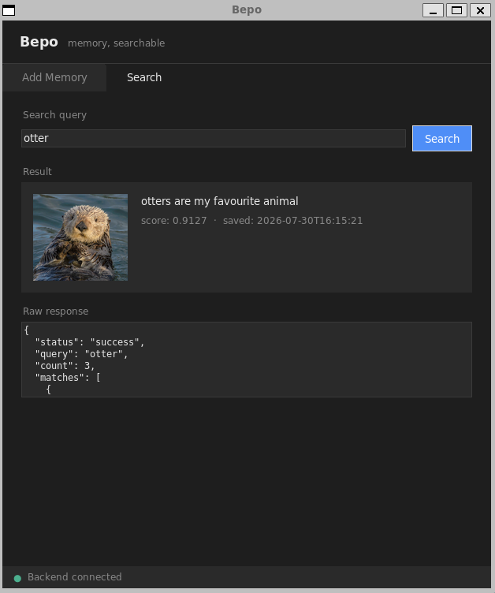

# Bepo

A Python FastAPI application for storing and searching memories with images, text notes, richer memory metadata, and GPS coordinates. It runs locally or as a small hosted Railway service.



## Features

- **Store Memories**: Upload photos with optional notes, richer metadata, and GPS coordinates
- **List & Retrieve Memories**: Browse all memories or fetch a single one by id
- **Serve Images**: Dedicated endpoint for serving stored image files
- **Semantic Search**: Search memories using natural language queries with configurable result count
- **Optional CLIP Embeddings**: Uses OpenAI's CLIP model for image and text embeddings when enabled, with a lightweight fallback for small deployments
- **Cosine Similarity**: Ranks matches by semantic similarity
- **SQLite Storage**: Local database with efficient BLOB storage for embeddings
- **Image Storage**: Saves uploaded images to the local filesystem or an attached Railway volume

## Mobile app (iOS and Android)

Bepo now includes a native Expo/React Native client in [`mobile/`](mobile/). It uses the phone camera/photo library, optional GPS, and secure on-device key storage while keeping the existing Railway service as its private backend.

For the quickest iPhone test, install Expo Go, run `npx expo start --tunnel` from `mobile/`, and scan the displayed QR code. See [`mobile/README.md`](mobile/README.md) for the testing and TestFlight paths.

> **Note:** `memories.db` and the `images/` directory are runtime data and are excluded from version control via `.gitignore`. When Railway attaches a volume, Bepo automatically stores both on that persistent volume.

## Installation

1. Install Python dependencies:
```bash
pip install -r requirements.txt
```

The default installation uses lightweight fallback embeddings. To enable the full CLIP model locally, install the optional dependencies and set the feature flag:

```bash
pip install -r requirements-clip.txt
BEPO_ENABLE_CLIP=1 python main.py
```

2. Run the application:
```bash
python main.py
```

The API will be available at `http://127.0.0.1:8000`

## Railway deployment

Bepo is ready for Railway's automatic Python build detection. The server reads Railway's injected `PORT` value and listens on all network interfaces.

1. Create a Railway project from the `enlorik/Bepo` GitHub repository.
2. Attach a persistent volume to the Bepo service and mount it at `/data`. Bepo automatically uses Railway's volume mount path for the SQLite database and uploaded images.
3. Add a service variable named `BEPO_API_KEY` with a long random value. When this variable is present, every application endpoint requires the value in an `X-API-Key` header. `/health` remains public for Railway.
4. Set the service healthcheck path to `/health`.
5. Generate a public domain under the service's Networking settings.

Verify the deployment:

```bash
curl https://YOUR-DOMAIN.up.railway.app/health
curl -H "X-API-Key: YOUR_SECRET" https://YOUR-DOMAIN.up.railway.app/
```

The lightweight hosted setup avoids downloading a large machine-learning model during startup. If the Railway service has enough memory and disk for CLIP, change its install command to `pip install -r requirements-clip.txt` and set `BEPO_ENABLE_CLIP=1`.

### Runtime variables

- `BEPO_API_KEY`: optional locally; strongly recommended for every public deployment
- `BEPO_DATA_DIR`: directory containing `memories.db` and `images/`
- `BEPO_DB_PATH`: overrides the SQLite file path
- `BEPO_IMAGES_DIR`: overrides the uploaded-image directory
- `BEPO_ENABLE_CLIP`: set to `1` to enable CLIP when its optional dependencies are installed
- `BEPO_CLIP_MIN_SIMILARITY`: minimum visual relevance score (default `0.24`)
- `BEPO_CLIP_CLUSTER_MAX_GAP`: largest score drop allowed inside the best-match cluster (default `0.025`)
- `BEPO_CLIP_CLUSTER_MAX_SPREAD`: farthest a clustered result may be from the best score (default `0.05`)
- `HOST`: server bind address; defaults to `0.0.0.0`
- `PORT`: server port; defaults to `8000`

## API Endpoints

### POST /memory

Store a new memory with a photo, optional text note/metadata, and GPS coordinates.

**Parameters:**
- `photo` (file, required): Image file to upload
- `note` (string, optional): Text note describing the memory
- `user_note` (string, optional): What the user noticed/felt in their own words
- `bepo_summary` (string, optional): Optional concise assistant-style summary of the memory
- `tags` (string, optional): Comma-separated or free-form tags
- `mood` (string, optional): Mood/emotion hint (for example `calm`, `excited`)
- `place_hint` (string, optional): Optional place cue (for example `near red couch hallway`)
- `taken_at` (ISO date/time, optional): When the photographed event happened
- `taken_at_source` (string, optional): `photo`, `camera`, or `manual`
- `lat` (float, optional): Latitude coordinate
- `lon` (float, optional): Longitude coordinate
- `location_source` (string, optional): `photo`, `current`, or `manual`

**Example:**
```bash
curl -X POST "http://127.0.0.1:8000/memory" \
  -F "photo=@path/to/image.jpg" \
  -F "note=Beautiful sunset at the beach" \
  -F "mood=calm" \
  -F "tags=beach,sunset" \
  -F "taken_at=2021-07-18T14:20:00" \
  -F "taken_at_source=photo" \
  -F "lat=34.0522" \
  -F "lon=-118.2437" \
  -F "location_source=photo"
```

**Response:**
```json
{
  "status": "success",
  "memory_id": 1,
  "timestamp": "2024-01-01T12:00:00.000000",
  "added_at": "2024-01-01T12:00:00.000000",
  "taken_at": "2021-07-18T14:20:00",
  "taken_at_source": "photo",
  "note_created_at": "2024-01-01T12:00:00.000000",
  "note_updated_at": "2024-01-01T12:00:00.000000",
  "image_path": "images/20240101_120000_000000.jpg",
  "image_url": "/image/1",
  "note": "Beautiful sunset at the beach",
  "user_note": null,
  "bepo_summary": null,
  "tags": "beach,sunset",
  "mood": "calm",
  "place_hint": null,
  "lat": 34.0522,
  "lon": -118.2437,
  "location_source": "photo",
  "map_url": "https://www.google.com/maps/search/?api=1&query=34.0522,-118.2437"
}
```

---

### PATCH /memory/{id}/metadata

Update editable memory metadata after a memory is created. This prepares Bepo for future chat-based memory annotation by letting later context refine what Bepo remembers about a photo.

**Request body (JSON, all fields optional):**
- `note` (string or `null`)
- `user_note` (string or `null`)
- `bepo_summary` (string or `null`)
- `tags` (string or `null`)
- `mood` (string or `null`)
- `place_hint` (string or `null`)

If a field is omitted, the existing value is preserved. If a field is sent as `null`, that field is cleared. After every metadata update, Bepo rebuilds the text embedding from the current text fields so search reflects the updated memory meaning.

**Example:**
```bash
curl -X PATCH "http://127.0.0.1:8000/memory/1/metadata" \
  -H "Content-Type: application/json" \
  -d '{
    "user_note": "I remember the quiet corner table",
    "tags": "cafe,quiet,corner",
    "mood": "peaceful",
    "place_hint": "near the back window"
  }'
```

**Response:**
```json
{
  "id": 1,
  "timestamp": "2024-01-01T12:00:00.000000",
  "note": "Beautiful sunset at the beach",
  "user_note": "I remember the quiet corner table",
  "bepo_summary": null,
  "tags": "cafe,quiet,corner",
  "mood": "peaceful",
  "place_hint": "near the back window",
  "lat": 34.0522,
  "lon": -118.2437,
  "image_path": "images/20240101_120000_000000.jpg",
  "image_url": "/image/1",
  "map_url": "https://www.google.com/maps/search/?api=1&query=34.0522,-118.2437"
}
```

---

### GET /memories

Return all saved memories in event-date order when the photo date is known. Embeddings are not included.
Includes separate event, added, and note timestamps plus `note`, `user_note`, `bepo_summary`, `tags`, `mood`, `place_hint`, `lat`, `lon`, `map_url`, and `image_url`.

**Example:**
```bash
curl "http://127.0.0.1:8000/memories"
```

**Response:**
```json
[
  {
    "id": 1,
    "timestamp": "2024-01-01T12:00:00.000000",
    "note": "Beautiful sunset at the beach",
    "lat": 34.0522,
    "lon": -118.2437,
    "image_path": "images/20240101_120000_000000.jpg",
    "image_url": "/image/1",
    "map_url": "https://www.google.com/maps/search/?api=1&query=34.0522,-118.2437"
  }
]
```

---

### GET /memory/{id}

Return a single memory by id. Returns 404 if not found.
Includes `note`, `user_note`, `bepo_summary`, `tags`, `mood`, `place_hint`, `lat`, `lon`, `map_url`, and `image_url`.

**Example:**
```bash
curl "http://127.0.0.1:8000/memory/1"
```

**Response:**
```json
{
  "id": 1,
  "timestamp": "2024-01-01T12:00:00.000000",
  "note": "Beautiful sunset at the beach",
  "lat": 34.0522,
  "lon": -118.2437,
  "image_path": "images/20240101_120000_000000.jpg",
  "image_url": "/image/1",
  "map_url": "https://www.google.com/maps/search/?api=1&query=34.0522,-118.2437"
}
```

---

### GET /image/{id}

Serve the image file associated with a memory. Designed for use by a mobile frontend.
Returns 404 if the memory or its image file does not exist.

**Example:**
```bash
curl "http://127.0.0.1:8000/image/1" --output photo.jpg
```

---

### POST /search

Search memories using a text query. Returns the top `top_k` matches ranked by similarity score.

**Parameters:**
- `query` (string, required): Search query text (must not be empty)
- `top_k` (int, optional, default 5, min 1, max 20): Number of results to return

**Example:**
```bash
curl -X POST "http://127.0.0.1:8000/search" \
  -F "query=sunset" \
  -F "top_k=3"
```

**Response (with results):**
```json
{
  "status": "success",
  "query": "sunset",
  "count": 1,
  "matches": [
    {
      "id": 1,
      "timestamp": "2024-01-01T12:00:00.000000",
      "image_path": "images/20240101_120000_000000.jpg",
      "image_url": "/image/1",
      "note": "Beautiful sunset at the beach",
      "user_note": null,
      "bepo_summary": null,
      "tags": "beach,sunset",
      "mood": "calm",
      "place_hint": null,
      "lat": 34.0522,
      "lon": -118.2437,
      "map_url": "https://www.google.com/maps/search/?api=1&query=34.0522,-118.2437",
      "score": 0.87
    }
  ]
}
```

**Response (empty database):**
```json
{
  "status": "no_results",
  "message": "No memories found in database",
  "matches": []
}
```

---

### POST /chat

Ask a natural question about saved memories. Bepo retrieves the most relevant memories and returns a simple, friendly answer built from the top match's metadata. **This is a local, deterministic chat-lite endpoint — it does not call any LLM or external API.**

**Request body (JSON):**
- `message` (string, required): Your question or description (must not be empty or whitespace-only)
- `top_k` (int, optional, default 3, min 1, max 10): Number of memories to retrieve

**Example:**
```bash
curl -X POST "http://127.0.0.1:8000/chat" \
  -H "Content-Type: application/json" \
  -d '{"message": "Where was that calm cafe with the cat?", "top_k": 3}'
```

**Response (with results):**
```json
{
  "status": "success",
  "message": "Where was that calm cafe with the cat?",
  "answer": "You may mean the memory near the red couch hallway. I remember it as calm, cafe, cat, cozy.",
  "count": 1,
  "memories": [
    {
      "id": 1,
      "timestamp": "2024-01-01T12:00:00.000000",
      "note": null,
      "user_note": null,
      "bepo_summary": null,
      "tags": "cafe,cat,cozy",
      "mood": "calm",
      "place_hint": "near the red couch hallway",
      "lat": null,
      "lon": null,
      "image_path": "images/20240101_120000_000000.jpg",
      "image_url": "/image/1",
      "map_url": null,
      "score": 0.72
    }
  ]
}
```

**Response (empty database):**
```json
{
  "status": "no_results",
  "message": "Where was that calm cafe with the cat?",
  "answer": "I do not have any memories saved yet.",
  "memories": []
}
```

The answer is built locally from the top memory's metadata (place hint, mood, tags, note/summary). No OpenAI or external API is involved.

---

### GET /

Returns API version information and a list of available endpoints.

## Running Tests

```bash
pip install -r requirements-dev.txt
python -m pytest tests/ -v
```

Tests disable CLIP/model downloads and run against temporary SQLite DB/filesystem paths (not your local `memories.db` or `images/`).

## CI

GitHub Actions runs `python -m pytest tests/ -v` on every pull request and on pushes to `main`.
CI sets `TRANSFORMERS_OFFLINE=1` and `HF_HUB_OFFLINE=1` defensively so tests never rely on model downloads.

## Database Schema

```sql
CREATE TABLE memories (
    id INTEGER PRIMARY KEY AUTOINCREMENT,
    ts DATETIME NOT NULL,
    taken_at DATETIME,
    taken_at_source TEXT,
    lat REAL,
    lon REAL,
    location_source TEXT,
    image_path TEXT NOT NULL,
    image_emb BLOB NOT NULL,
    text_note TEXT,
    text_emb BLOB,
    note_created_at DATETIME,
    note_updated_at DATETIME,
    user_note TEXT,
    bepo_summary TEXT,
    tags TEXT,
    mood TEXT,
    place_hint TEXT
);
```

`ts` remains the time a memory was added and `text_note` is kept for backward compatibility. `taken_at` is the original event time when known. On startup, Bepo runs a migration-safe schema check (`PRAGMA table_info(memories)` + `ALTER TABLE ... ADD COLUMN`) so existing `memories.db` files are upgraded in place without dropping data.

For semantic search, Bepo builds text embeddings from all available memory text fields (`note`, `user_note`, `bepo_summary`, `tags`, `mood`, `place_hint`). These richer fields are intended for future Bepo chat and personal recall features.

## Architecture

- **FastAPI**: Web framework for the REST API
- **SQLite**: Local database for storing memories and embeddings
- **Optional CLIP (openai/clip-vit-base-patch32)**: Generates richer embeddings for images and text when enabled
- **PIL (Pillow)**: Image processing
- **Optional PyTorch**: Deep learning framework used by CLIP
- **NumPy**: Efficient array operations and cosine similarity calculation

## Data and external services

Bepo does not call a hosted AI API. All processing happens inside the running Bepo service:
- The default lightweight mode makes no external model calls
- Optional CLIP mode downloads its model on first startup unless it is already cached
- Memory records stay in SQLite (`memories.db`)
- Images stay in the configured `images/` directory
- On Railway, attach a persistent volume so both survive deploys and restarts
- Both `memories.db` and `images/` are excluded from git

## Design notes

**Why CLIP** — CLIP (Contrastive Language–Image Pretraining) was trained on 400 million image–caption pairs with a contrastive objective that pushes matching pairs together in a shared embedding space. The result is that the image encoder and text encoder share a coordinate system: the query "red couch" lands near photographs of red couches without any captioning step, keyword tags, or OCR.

**Why max instead of average for score fusion** — Each memory gets two scores: one from the image channel, one from the text channel. A photo of a red couch captioned "grandma's visit" should surface for "red couch" (image fires) and for "grandma" (text fires). Averaging would dilute a strong single-channel match with an irrelevant score from the other channel. The tradeoff is that matching both channels simultaneously isn't rewarded extra — a weighted sum is the tuning knob if that matters later.

**Why an exact scan instead of an approximate index** — 10,000 memories is around 5 million multiply-adds in NumPy, which takes milliseconds. Adding FAISS or hnswlib at that scale would add complexity and trade exactness for a speed gain that isn't needed. The upgrade path when scale demands it: matrix-ise the scan first (`M @ q`, one BLAS call), cache the matrix in RAM, then add an ANN index when the collection approaches 10⁵ entries or becomes multi-user.

**Why SQLite with BLOB embeddings** — Everything runs on one machine with no external service dependency. A single file is straightforward to back up and reason about. The cost is no vector index (hence the exact scan) and two sources of truth: the database holds a path, the actual image file lives on the filesystem.

